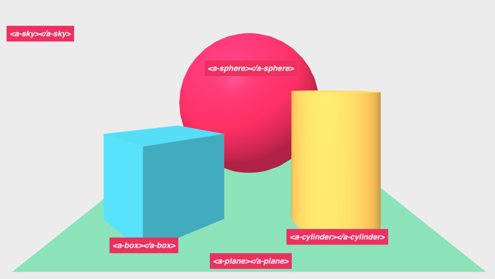

<!-- Title slide. -->
<!-- .slide: data-background="media/img/aframe.jpg" -->

  <h1>Школа A-Frame</h1>
  <h3>Интерактивный курс по WebVR</h3>
  

    <b><a href="https://aframe.io">aframe.io</a></b>
  

------

## Пролог

<!-- .slide: data-background="media/img/aframe.jpg" -->

> С помощью [Glitch](https://glitch.com) в школе вам даются упражнения «шаг за шагом»,
> чтобы помочь вам погрузиться в мир [WebVR](https://webvr.rocks)! В школе перемещение
> по разделам осуществляется &larr; and &rarr, а перемещение между подразделами **&uarr; and
> &darr;**:

**Навигация &darr;**

---

### Полезные ресурсы во время вашего путешествия

1. [Просмотрите Документацию и Часто задаваемые вопросы](https://aframe.io/docs/)
2. [Обратитесь за помощь на Slack](https://aframe.io/community/#slack)
3. [Задайте вопрос на Stack Overflow](http://stackoverflow.com/questions/ask/?tags=aframe)
4. Если вы участвуете в семинаре , то поднимите свою руку, если у вас есть вопрос!

**Навигация &rarr;**

<!-- Lessons start below. -->

------

## Glitch &mdash; введение

> Школа использует [Glitch](https://glitch.com) в качестве среды обучения
> и разработки для A-Frame

- Glitch запускает ваш код в браузере без необходимости дополнительноустанавливать
что-нибудь ещё
- Glitch позволяет **переделывать** проекты с использованием существующих проектов A-Frame
  в качестве отправной точки
- Glitch мгновенно публикует и хранит ваш сайт с URL-адресом (например,
  `https://aframe.glitch.me`)
- Glitch обновляет ваш сайт с A-Frame в реальном времени при каждом изменении кода
- Glitch позволяет нескольким людям работать с кодом в одном проекте

*Если вы заинтересованы в установке локального окружения для разработки, пропустите шаг &darr;*

---

## Glitch &mdash; переделывание существующего проекта

> Glitch позволяет переделать (или сделать ответвление) существующий проект и использовать это в качестве основы для вашего
> нового проекта. Перед тем как начать, мы рекомендуем связать аккаунт в Glitch с вашим [аккаунтом в GitHub
> ](https://github.com/). Glitch предоставит вам имя проекта и его URL-адрес,
> сгенерированные случайным образом, которые вы можете изменить.

<a href="https://glitch.com/~aframe/" target="_blank">Переделать заготовленные проекты A-Frame в Glitch</a>  <!-- .element: class="cta-button glitch" -->

---

## Glitch &mdash; редактирование кода

> После того, как вы [переделали заготовку A-Frame в Glitch](https://glitch.com/~aframe/),
> проверьте, где вы будете редактировать свой код. Осмотритесь вокруг и убедитесь, что вы можете
> редактировать код серверной части, загружать ассеты, создавать новые файлы, или приглашать 
> других, чтобы редактировать с вами!

---

## Glitch &mdash; просмотр вашего проекта

> После того как вы поработали в редакторе, посмотрите ваш проект в действии.

---

## Glitch &mdash; экспортирование вашего проекта

> В любой момент времени, если вы захотите скачать свой проект или экспортировать его на GitHub, можете
> обратиться к пункту меню *Дополнительные опции*. Скачивание даст вам файл с расширением `.tgz`, который вы сможете
> распаковать. В проектах A-Frame, от вас потребуется работать с тем, что находится в директории `public/`,
> а код серверной части игнорировать.

Если вы скачиваете проект, вам
может быть интересно узнать про создание окружения для веб-разработки в следующем
разделе **&darr;**. В противном случае, жмите **&rarr;** для того, чтобы приступить к изучению A-Frame!

---

## [Дополнительно] Установка окружения web-разработки

> Вы можете установить полноценное окружение web-разработки на вашей локальной машине,
> а не использовать онлайн-среду web-разработки Glitch.

1. **Получите текстовый редактор:** [Atom](https://atom.io) хороший вариант для начала
2. **Установите локальный сервер:** Скачайте и запустите [Mongoose
Server](https://www.cesanta.com/products/binary) или запустите `python -m
SimpleHTTPServer` в консоли
3. **Создайте файл `index.html`** и скопируйте код A-Frame из представленных в Glitch примеров
4. **Запустите локальный сервер** в той же директории, что и файл HTML
5. **Откройте URL-адрес локального сервера** в вашем браузере (например, `http://localhost:8000`)
6. **Внесите изменения** в ваш HTML файл и перезагрузите браузер, чтобы увидеть их
7. Дополнительно: попробуйте [ngrok](https://ngrok.io) для того, чтобы любое устройство в любой
сети имело доступ к вашему локальному серверу

---

## [Дополнительно] Установка окружения web-разработки &mdash; получите текстовый редактор

> [Atom](https://atom.io) — хороший текстовый редактор для начала, если у вас нет ничего другого.
> Другими популярными вариантами являются: [Notepad++](https://notepad-plus-plus.org/),
> [Sublime](https://www.sublimetext.com/), [Brackets](http://brackets.io/) или
> [vim](http://www.vim.org/download.php).

---

## [Дополнительно] Установка окружения web-разработки &mdash; установите локальный сервер

> Вам будет нужен локальный HTTP-сервер, чтобы обслуживать ваши файлы в браузере.

  

    
    <a href="https://www.cesanta.com/products/binary">Mongoose Binary</a>
  

  

    
    <code>python -m SimpleHTTPServer 8080</code>
  

  

    
    <a href="https://docs.npmjs.com/getting-started/installing-node">Node + npm + live-server</a>
  

---

## [Дополнительно] Установка окружения web-разработки &mdash; используйте ngrok

> При желании вы можете использовать [ngrok](https://ngrok.com/) для того, чтобы разрабатывать свой
> A-Frame проект со смартфона без необходимости выполнять настройку доступа к локальному IP-адресу.

1. Скачайте и распакуйте [ngrok](https://ngrok.com/download/) в любое место
2. Запустите ngrok, предоставив ему номер порта вашего локального сервера (`./ngrok http 8080`)
3. ngrok предоставит вам URL-адрес, состоящий из набора букв и цифр (e.g., `https://abcdef123456.ngrok.io`)
4. Откройте этот URL-адрес с другого устройства в любой сети (таком как смартфон или другой компьютер)

------

## Попробуйте примеры A-Frame

> Поработайте с примерами в вашем десктопе или смартфоне [на странице
> A-Frame](https://aframe.io), [в блоге A-Frame](https://aframe.io/blog/), или
> [awesome-aframe](https://github.com/aframevr/awesome-aframe). Посмотрите
> [webvr.rocks](https://webvr.rocks) для получения информации о настройке WebVR with с
> гарнитурой, если она у вас есть.

------

## Начните с *Привет, WebVR*

> A-Frame предоставляет простые в использовании HTML элементы, называемые
[примитивами](https://aframe.io/docs/0.5.0/primitives/). В разделе ниже
мы изменим основные мэши через HTML аттрибуты (например, цвет,
положение, вращение, масштаб) и дадим почувствовать рабочий процесс.

---

## Начните с *Привет, WebVR* &mdash; положение

> Положение определяет где объекты находятся в трехмерном пространстве (X, Y, Z) в метрах. Изменяйте
> `положение` объектов через атрибуты `позиции` в HTML. [Почитайте о
> положениях](https://aframe.io/docs/master/components/position.html).

<a href="https://glitch.com/~aframe-school-position" target="_blank">Переделать урок в Glitch</a>  <!-- .element: class="cta-button glitch" -->

1. Переместите цилиндр влево, чтобы *уменьшить* значение `позиции` по оси X
2. Переместите поле вверх, чтобы *увеличить* значение `позиции` по оси Y
3. Переместите сферу назад, чтобы *уменьшить* значение `позиции` по оси Z
4. **Дополнительно:** Добавьте `<a-ring>` в качестве дочернего элемента `<a-sphere>` и дайте ему возможность видеть относительные позиции

<a href="https://aframe-school-position.glitch.me/solution.html" target="_blank">Посмотреть результат</a>  <!-- .element: class="cta-button" -->

---

## Начните с *Привет, WebVR* &mdash; вращение

> Вращение определяет ориентацию объектов в трехмерном пространстве (по осям X, Y, Z)
> в градусах. Используйте правило правой руки, чтобы пространственно визуализировать вращение. [Почитайте о
> вращениях](https://aframe.io/docs/master/components/rotation.html).

<a href="https://glitch.com/~aframe-school-rotation" target="_blank">Переделать урок в Glitch</a>  <!-- .element: class="cta-button glitch" -->

1. Поверните цилиндр вокруг оси X так, чтобы мы увидели его дно
2. Поверните поле вокруг оси Y так, чтобы оно было обращено прямо
3. **Дополнительно:** Оберните контент сцены в `<a-entity>` (как `
`)
и поверните её, чтобы увидеть относительные вращения

<a href="https://aframe-school-rotation.glitch.me/solution.html" target="_blank">Посмотреть результат</a>  <!-- .element: class="cta-button" -->

---

## Начните с *Привет, WebVR* &mdash; добавление примитивов

> Добавьте примитивы в сцену, включив HTML элементы внутрь `<a-scene>`.  [Почитайте
> о примитивах](https://aframe.io/docs/0.5.0/primitives/).

<a href="https://glitch.com/~aframe-school-primitives" target="_blank">Переделать урок в Glitch</a>  <!-- .element: class="cta-button glitch" -->

1. Добавьте [`<a-torus-knot>`](https://aframe.io/docs/0.5.0/primitives/a-torus-knot.html) в левую часть
2. Добавьте [`<a-dodecahedron>`](https://aframe.io/docs/0.5.0/primitives/a-dodecahedron.html) в правую часть
3. Добавьте [`<a-text>`](https://aframe.io/docs/0.5.0/primitives/a-text.html), выровненный по центру

<a href="https://aframe-school-primitives.glitch.me/solution.html" target="_blank">Посмотреть результат</a>  <!-- .element: class="cta-button" -->

------

## Добавление текстур &mdash; загрузка ассетов

> Мы добавим изображения текстур к мэшам для лучшего внешнего вида, чем при заливке плоскости цветом.
> [Найдите ваши собственные изображения
> онлайн](https://aframe.io/docs/0.5.0/introduction/faq.html#where-can-i-find-assets),
> и загрузите их через раздел ассетов в Glitch или через загрузчик
> [cdn.aframe.io](https://cdn.aframe.io). Куда бы вы ни загрузили данные, убедитесь,
> что там поддерживается
> [CORS](https://developer.mozilla.org/docs/Web/HTTP/Access_control_CORS)
> поверх HTTPS.

В Glitch внизу **&darr;**, некоторые ассеты уже будут предоставлены в
разделе ассетов (на изображении выше).

---

## Добавление текстур &mdash; текстуры изображений

> Заполните HTML-атрибуты `src` с URL-адресами изображений. [Прочитайте об использовании
> текстур изображений](https://aframe.io/docs/0.5.0/guides/building-a-basic-scene.html#applying-an-image-texture).

<a href="https://glitch.com/~aframe-school-textures/" target="_blank">Переделать урок в Glitch</a>  <!-- .element: class="cta-button glitch" -->

1. Добавьте текстуру на землю, `<a-plane>`
2. Добавьте текстуры в `<a-box>`ы
3. Добавьте текстуру в `<a-sphere>`
4. Добавьте текстуру в `<a-cone>`
5. Добавьте текстуру на задний план, `<a-sky>`. Найдите [панорамные изображения 360&deg; на FLickr](https://www.flickr.com/groups/equirectangular/)

<a href="https://aframe-school-textures.glitch.me/solution.html" target="_blank">Посмотреть результат</a>  <!-- .element: class="cta-button" -->

------

## Откройте Инспектор A-Frame

> Нажмите **`<ctrl> + <alt> + i`** на **любой** сцене A-Frame, чтобы открыть визуальный
> редактор, подобно Dev Tools в вашем браузере!  Попробуйте Инспектор на каком-либо из
> [примеров](https://aframe.io/examples/). [Прочитать про Инспектор](https://aframe.io/docs/master/guides/using-the-aframe-inspector.html).

---

## Откройте Инспектор A-Frame &mdash; изменение значений компонентов

> Измените объект, изменив его компоненты на правой панели.
> Инспектор знает обо всех компонентах A-Frame, включая community-компоненты.
>  Этот пример включает внешний компонент [text-geometry](https://www.npmjs.com/package/aframe-text-geometry-component),
> в котором Инспектор может изменить значения.

<a href="https://aframe-vaporwave.glitch.me" target="_blank">Открыть пример в Glitch</a>  <!-- .element: class="cta-button glitch" -->

1. Выберите один из объектов с текстом в примере
2. Измените `значение` свойства у [компонента `text-geometry`](https://www.npmjs.com/package/aframe-text-geometry-component)

---

## Откройте Инспектор A-Frame &mdash; присоединение компонентов из реестра

> Используйте [физические компоненты](https://github.com/donmccurdy/aframe-physics-system)
> из [реестра](https://aframe.io/registry/), чтобы добавить гравитацию и столкновения.
> Реестр представляет собой курируемую коллекцию компонентов A-Frame. Инспектор
> подключается к реестру, чтобы мы могли добавить компоненты в панель сущностей.

<a href="https://aframe-vaporwave.glitch.me" target="_blank">Открыть пример в Glitch</a>  <!-- .element: class="cta-button glitch" -->

1. Добавьте `статический` компонент в наземную сетку
2. Добавьте `динамический` компонент к торическому узлу (фиолетовый крендель сзади)
3. Увеличьте значение позиции по оси Y у торического узла, чтобы сделать его выше
4. Покиньте Инспектор

------

## Создайте entity-компонент &mdash; переделка элементов-примитивов

> Помимо простых в использовании элементов-примитивов A-Frame основывается на
> архитектуре entity-компонентов. Разложите элементы-примитивы в примере
> *Привет, WebVR* в `<a-entity>` с их фундаментальными компонентами.

<a href="https://glitch.com/~aframe-school-ecs" target="_blank">Переделать урок в Glitch</a>  <!-- .element: class="cta-button glitch" -->

[geometry]: https://aframe.io/docs/0.5.0/components/geometry.html
[material]: https://aframe.io/docs/0.5.0/components/material.html

1. Сконвертируйте `<a-box>` в `<a-entity>` с [компонентом geometry][geometry] и [компонентом material][material]. Сконфигурируйте компонент geometry как `primitive: box`
2. Сконвертируйте `<a-sphere>` в `<a-entity>` с компонентом geometry и компонентом material. Сконфигурируйте компонент geometry как `primitive: sphere`
3. Сконвертируйте `<a-cylinder>` в `<a-entity>` с компонентом geometry и компонентом material. Сконфигурируйте компонент geometry как `primitive: cylinder`
4. Сконвертируйте `<a-plane>` в `<a-entity>` с компонентом geometry и компонентом material. Сконфигурируйте компонент geometry как `primitive: plane`
5. Сконвертируйте `<a-sky>` в `<a-entity>` с компонентом geometry и компонентом material. Сконфигурируйте компонент как `primitive: sphere` с атрибутом `radius: 3000`, а также сконфигурируйте компонент material как `shader: flat` (не будут проводиться трудоёмкие вычисления освещённости, когда на нужен плоский цвет)

<a href="https://aframe-school-ecs.glitch.me/solution.html" target="_blank">Посмотреть результат</a>  <!-- .element: class="cta-button" -->

---

## Создайте entity-компонент &mdash; добавление сферы источника света

> Используйте шаблон entity-компонента, чтобы добавить сферу, которая действует также как точечный
> источник света. Смешайте компоненты geometry, material и light, чтобы
> создать этот тип объекта.

1. Поищите `<a-entity id="lightSphere">`
2. Прикрепите [компонент geometry](https://aframe.io/docs/0.5.0/components/geometry.html) с настройкой `primitive: sphere`
3. Прикрепите [компонент material](https://aframe.io/docs/0.5.0/components/material.html) с настройкой `color: #FFF` и `shader: flat`
4. Прикрепите [компонент light](https://aframe.io/docs/0.5.0/components/light.html) с настройкой `type: point`
5. **Дополнительно:** Добавьте компонент анимации из [реестра](https://aframe.io/registry/) с помощью тега `<script>`. Добавьте анимацию с настройкой `property: position` и `dir: alternate`, и `loop: true`, и с указанием значения позиции `to: <POSITION>`

<a href="https://glitch.com/~aframe-school-ecs-light-sphere" target="_blank">Переделать урок в Glitch</a>  <!-- .element: class="cta-button glitch" -->

>

<a href="https://aframe-school-ecs-light-sphere.glitch.me/solution.html" target="_blank">Посмотреть результат</a>  <!-- .element class="cta-button" -->

------

## Создайте entity-компонент &mdash; работа с реестром

> [Реестр](https://aframe.io/registry/) &mdash; отличное место для заимствования классных
> компонентов, добавленных туда сообществом A-Frame. Похоже на сторонние
> плагины. Найдите компоненты сообщества в реестра, скопируйте их JS-ссылки,
> включите их с помощью тега `<script>` и используйте их прямо внутри HTML.

1. Включите [Particle
System](https://www.npmjs.com/package/aframe-particle-system-component). Прикрепите
`<a-entity>` с компонентами `particle-system` с настройкой `preset: default`
и `preset: snow`. Откройте Inspector, чтобы поиграть со значениями!
2. Включите [Animation](https://www.npmjs.com/package/aframe-animation-component). Прикрепите
анимацию к сфере, чтобы изменить её масштаб с настройками компонента `animation` &mdash; `property: scale`, `loop: true` и `to: 1.1 1.1 1.1`
3. Включите [Outline Effect](https://www.npmjs.com/package/aframe-outline-effect) (контурный эффект). Перейдите в
`<script>` и добавьте компонент `outline` в сцену

<a href="https://glitch.com/~aframe-school-registry" target="_blank">Переделать урок в Glitch</a>  <!-- .element: class="cta-button glitch" -->

<a href="https://aframe-school-registry.glitch.me/solution.html" target="_blank">Посмотреть результат</a>  <!-- .element class="cta-button" -->

------

## Используйте JavaScript

> Используйте JavaScript и DOM API для программного изменения сцены и
> объектов (entities). A-Frame &mdash; это не только HTML; A-Frame обеспечивает доступ к JavaScript,
> DOM API и three.js с полным контролем.  [Почитать *об использовании
> JavaScript и DOM API* совместно с
> A-Frame](https://aframe.io/docs/0.5.0/guides/using-javascript-and-dom-apis.html).

<a href="https://glitch.com/~aframe-school-js" target="_blank">Переделать урок в Glitch</a>  <!-- .element: class="cta-button glitch" -->

Чтобы посмотреть логи JavaScript мы можем открыть консоль разработчика в браузере, щелкнув правой клавишей
по странице и выбрав *Inspect* или *Inspect Element*, а затем
щелкнув вкладку *Console*. При просмотре решений мы можем видеть результаты
через консоль браузера.

---

## Используйте JavaScript &mdash; получение объектов

> Используйте
> [`document.querySelector()`](https://developer.mozilla.org/docs/Web/API/Document/querySelector)
> и
> [`document.querySelectorAll()`](https://developer.mozilla.org/docs/Web/API/Document/querySelectorAll),
> чтобы получить ссылку на сцену и её объекты (entities).  [Почитать про запрос
> объектов](https://aframe.io/docs/0.5.0/guides/using-javascript-and-dom-apis.html#getting-entities-by-querying-and-traversing).

<a href="https://glitch.com/~aframe-school-js" target="_blank">Переделать урок в Glitch</a>  <!-- .element: class="cta-button glitch" -->

1. Получите ссылку на элемент `<a-scene>`, используя `var sceneEl = document.querySelector('a-scene');`
2. Получите ссылку на все элементы `<a-entity>`, используя `sceneEl.querySelectorAll('a-entity');`
3. Получите ссылку на объект box, используя `sceneEl.querySelector('#box');`
4. Получите ссылку на объекты sphere и cylinder в одном вызове `.querySelectorAll()` с помощью многоэлементного селектора 
. Получите ссылку на объекты sphere и cylinder в одном вызове `.querySelectorAll()`, добавив и выбрав классы HTML

<a href="https://aframe-school-js.glitch.me/solution.html" target="_blank">Посмотреть результат</a>  <!-- .element: class="cta-button" -->

---

## Используйте JavaScript &mdash; изменение объектов

> Используйте
> [`Entity.setAttribute()`](https://aframe.io/docs/0.5.0/core/entity.html#setattribute-attr-value-componentattrvalue)
> для изменения объектов после их извлечения из предыдущего упражнения. [Почитать
> про изменение
> объектов](https://aframe.io/docs/0.5.0/guides/using-javascript-and-dom-apis.html#modifying-an-entity).

<a href="https://glitch.com/~aframe-school-js" target="_blank">Переделать урок в Glitch</a>  <!-- .element: class="cta-button glitch" -->

1. Измените компонент `rotation` в объекте box
2. Измените свойство `height` компонента `geometry` в объекте cylinder
3. Измените свойство `metalness` компонента `material` в объекте sphere

<a href="https://aframe-school-js.glitch.me/solution2.html" target="_blank">Посмотреть результат</a>  <!-- .element: class="cta-button" -->

---

## Используйте JavaScript &mdash; создание объектов

> Используйте [`document.createElement()`](https://developer.mozilla.org/docs/Web/API/Document/createElement)
> для создания объектов и `.setAttribute()` для их конфигурирования, и `.appendChild()`
> для их добавления в сцену.  [Почитать про создание
> объектов](https://aframe.io/docs/0.5.0/guides/using-javascript-and-dom-apis.html#creating-an-entity-with-createelement).

<a href="https://glitch.com/~aframe-school-js" target="_blank">Переделать урок в Glitch</a>  <!-- .element: class="cta-button glitch" -->

1. В JavaScript-цикле `for` создайте и добавьте 50 элементов `<a-box>` с
позициями и размерами, заданными случайным образом (используйте `Math.random()`)

<a href="https://aframe-school-js.glitch.me/solution3.html" target="_blank">Посмотреть результат</a>  <!-- .element: class="cta-button" -->

---

## Используйте JavaScript &mdash; обработка событий

> Используйте
> [`.addEventListener()`](https://developer.mozilla.org/docs/Web/API/EventTarget/addEventListener),
> чтобы зарегистрировать функцию-обработчик, которая будет вызвана при наструплении определенного события.
> Затем вручную инициируйте это событие, чтобы увидеть исполнение функции-обработчика. Позже мы
> сможем использовать прослушиватели событий (event listeners) для изменения сцены, основанной на пользовательском вводе или
> других событиях. [Почитать про события и прослушивание событий совместно с
> A-Frame](https://aframe.io/docs/0.5.0/guides/using-javascript-and-dom-apis.html#events-and-event-listeners).

<a href="https://glitch.com/~aframe-school-js" target="_blank">Переделать урок в Glitch</a>  <!-- .element: class="cta-button glitch" -->

1. Зарегистрируйте event listener в объекте box для того, чтобы поймать событие `foo`. В
   функции-обработчике измените цвет объекта box
2. Инициируйте событие `foo` с помощью вызова
[`Entity.emit()`](https://aframe.io/docs/0.5.0/core/entity.html#emit-name-detail-bubbles)
и смотрите как в объекте box изменится цвет

<a href="https://aframe-school-js.glitch.me/solution4.html" target="_blank">Посмотреть результат</a>  <!-- .element: class="cta-button" -->

------

## Добавьте Gaze-Based Cursor &mdash; добавление объекта Cursor

> Используйте управляемый взглядом компонент [`cursor`
> ](https://aframe.io/docs/0.5.0/components/cursor.html), чтобы обеспечить
> возможность взаимодействия с сущностями (прежде всего для смартфонов).  [Почитать
> про создание галереи изображений с обзором 360&deg;](https://aframe.io/docs/0.5.0/guides/building-with-components.html).

<a href="https://glitch.com/~aframe-school-cursor" target="_blank">Переделать урок на Glitch</a>  <!-- .element: class="cta-button glitch" -->

На этом занятии все обработчики событий уже подключены. Нам просто нужно добавить
объект с компонентом `cursor`, который будет предоставлять эти события на основе
пользовательского ввода.  Обратите внимание, что эти события не поддерживаются браузером, а создаются 
с помощью A-Frame.

1. Добавьте объект [`<a-camera>`](https://aframe.io/docs/0.5.0/components/camera.html).
   Ранее A-Frame предоставлял объект camera, созданный по умолчанию
2. Добавьте объект [`<a-cursor>`](https://aframe.io/docs/0.5.0/components/cursor.html)
   в качестве дочернего элемента под объектом camera
3. Drag the camera around the click on the panels on desktop. On smartphones,
   stare at the panels to trigger clicks (i.e., gaze-based)

<a href="https://aframe-school-cursor.glitch.me/solution.html" target="_blank">Посмотреть результат</a>  <!-- .element: class="cta-button glitch" -->

---

## Add Gaze-Based Cursor Interactions &mdash; Handle Events

> Use the `click`, `mouseenter`, `mouseleave` events provided by the gaze-based
> [`cursor` component](https://aframe.io/docs/0.5.0/components/cursor.html) to
> change the properties of an object.

The Glitch code will have the project structure set up. We can add JavaScript
code inside the `handle-events` component, marked by the code comments.

<a href="https://glitch.com/~aframe-school-cursor-handler" target="_blank">Remix Lesson on Glitch</a>  <!-- .element: class="cta-button glitch" -->

1. Attach our `controller-event-handler` to the cubes. We can attach to all of them at once through the mixin
2. Add an event listener to change the box's color on `mouseenter` event
3. Add an event listener to restore the box's color on `mouseleave` event

<a href="https://aframe-school-cursor-handler.glitch.me/solution.html" target="_blank">View Result</a>  <!-- .element: class="cta-button glitch" -->

------

## Добавляйте 3D модели &mdash; glTF модель

> 3D модели похожи на изображения 3D приложений и приложений виртуальной реальности (VR), хотя они и немного
> тяжелее. 3D модель создается заранее в программе 3D-моделирования, такой как
> [Blender](https://www.blender.org/) и состоит из вершин, текстур,
> материалов. Мы рекомендуем использовать [glTF](https://github.com/KhronosGroup/glTF) &mdash; это
> относительно новый стандарт формата 3D файлов, специально разработанный для Web. glTF подобен
> JPG в мире 3D моделей.

<a href="https://glitch.com/~aframe-school-gltf-model" target="_blank">Переделать урок в Glitch</a>  <!-- .element: class="cta-button glitch" -->

1. Добавьте `https://cdn.aframe.io/test-models/models/virtualcity/VC.gltf` внутрь
`<a-asset-item id="cityModel">` в атрибут `src` для предварительной загрузки модели
2. Добавьте `#cityModel` внутрь `<a-gltf-model>` в атрибут `src` для установки и добавления модели

<a href="https://aframe-school-gltf-model.glitch.me/solution.html" target="_blank">Посмотреть результат</a>  <!-- .element: class="cta-button" -->

---

## Добавляйте 3D модели &mdash; анимация модели glTF

> Модели могут поставляться с анимацией. В приведенной выше модели имеется много анимаций
> кораблей, масштабирующихся по всему городу. В предыдущем Glitch мы предоставили простой
> компонент `play-all-model-animations`, который мы можем применить к нашей модели, чтобы воспроизвести
> её анимации. Продолжайте работать в вашем текущем Glitch.

1. Включите компонент `animation-mixer` с помощью `<script>` внутрь
`<head>` после скрипта A-Frame. Этот компонент в настоящее время находится в реестре
и может быть включен в A-Frame. `https://unpkg.com/aframe-extras.animation-mixer@3.4.0/dist/aframe-extras.animation-mixer.js`
2. Прикрепите компонент `animation-mixer` к `<a-gltf-model>`,
установив его через HTML-атрибут `animation-mixer`. По умолчанию это будет воспроизводить сразу все
анимации модели.

<a href="https://aframe-school-gltf-model.glitch.me/solution2.html" target="_blank">Посмотреть результат</a>  <!-- .element: class="cta-button" -->

---

## Добавляйте 3D модели &mdash; загрузка 3D моделей

> Если у вас есть собственная модель, то могут быть трудности с её загрузкой на CDN, поскольку
> она состоит из из нескольких файлов, которые ссылаются друг на друга. Пока что самый простой
> способ &mdash; загрузить их в репозиторий GitHub, опубликовать ветвь master
> на GitHub Pages, и использовать `rawgit.com` для их обслуживания. В качестве альтернативы
> вы можете настроить Amazon S3. И это ещё не всё.

------

## Add Tracked Controls &mdash; Add Hand Controls

> Tracked hand controls provide immersion and interactivity with hand
> controllers. In the following Glitch, we've pre-recorded hand control
> movements and button presses with [A-Frame Motion
> Capture](https://github.com/dmarcos/aframe-motion-capture-components).
> Now we just have to add the hands and handle the interaction events.

<a href="https://glitch.com/~aframe-school-hand-controls" target="_blank">Remix Lesson on Glitch</a>  <!-- .element: class="cta-button glitch" -->

1. Find `<a-entity id="left">` and add the [hand-controls component](https://aframe.io/docs/0.5.0/components/hand-controls.html)
configured to the left hand (`hand-controls="left"`)
2. Find `<a-entity id="right">` and add the hand-controls component
configured to the right hand (`hand-controls="right"`)
3. View the result and see the hands moving with pre-recorded motions

<a href="https://aframe-school-hand-controls.glitch.me/solution.html" target="_blank">View Result</a>  <!-- .element: class="cta-button" -->

---

## Add Tracked Controls &mdash; Add Interactivity

> There are many components to add interactivity to hand controls.
> [controller-cursor](https://github.com/bryik/aframe-controller-cursor-component),
> [aabb-collider +
> grab](https://github.com/aframevr/aframe/tree/master/examples/showcase/tracked-controls/components),
> [super-hands](https://github.com/wmurphyrd/aframe-super-hands-component). For
> this lesson, we'll use controller-cursor that acts as a pointing laser for
> each hand. Continue from your previous Glitch.

1. Add `controller-cursor` component to both hands
2. In the `controller-event-handler` component, change the color of the boxes
when they are hovered over with the `mouseenter` event, and restore the color
with the `mouseleave` event

<a href="https://aframe-school-hand-controls.glitch.me/solution2.html" target="_blank">View Result</a>  <!-- .element: class="cta-button" -->

------

<!-- Lessons end here. -->

## Поздравления!

Вы закончили школу A-Frame и теперь получили виртуальную несертифицированную
степень по WebVR.

Обратитесь к [документации](https://aframe.io/docs/), чтобы получить больше знаний и стать
мастером.
